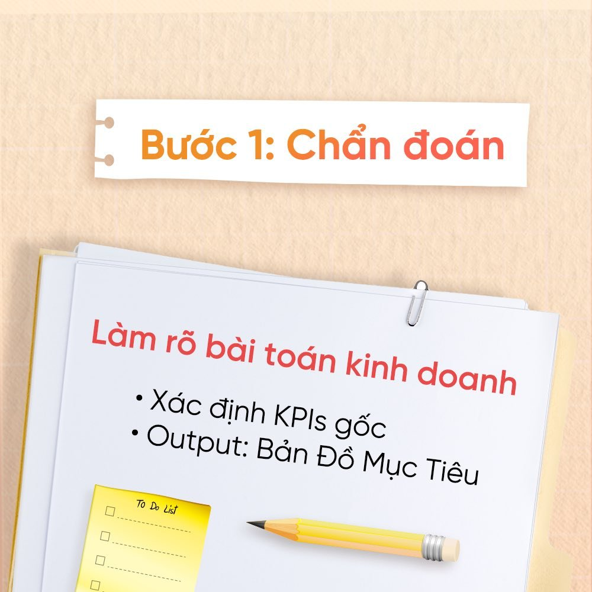
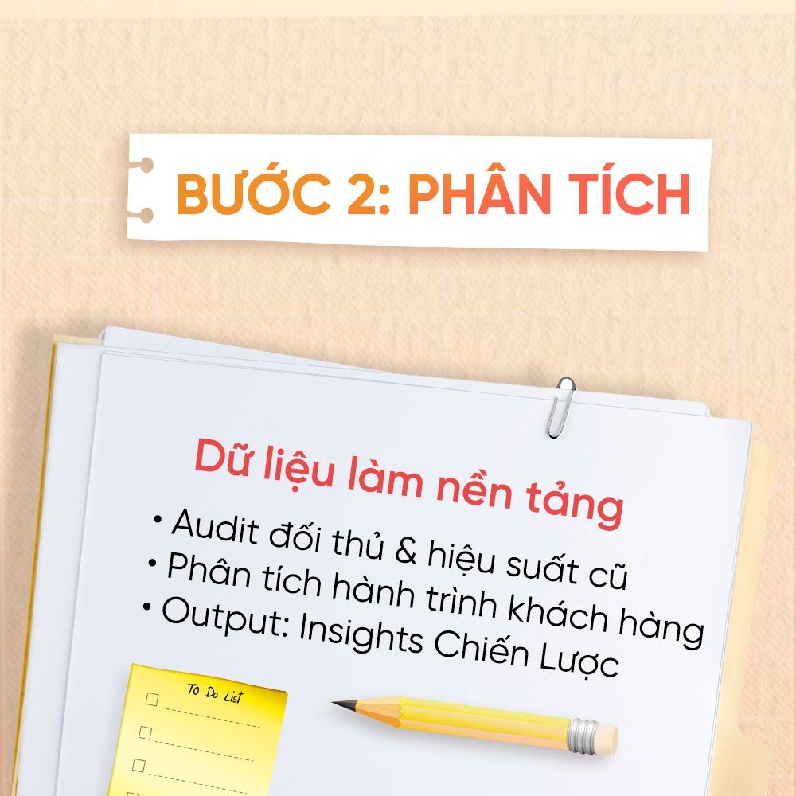
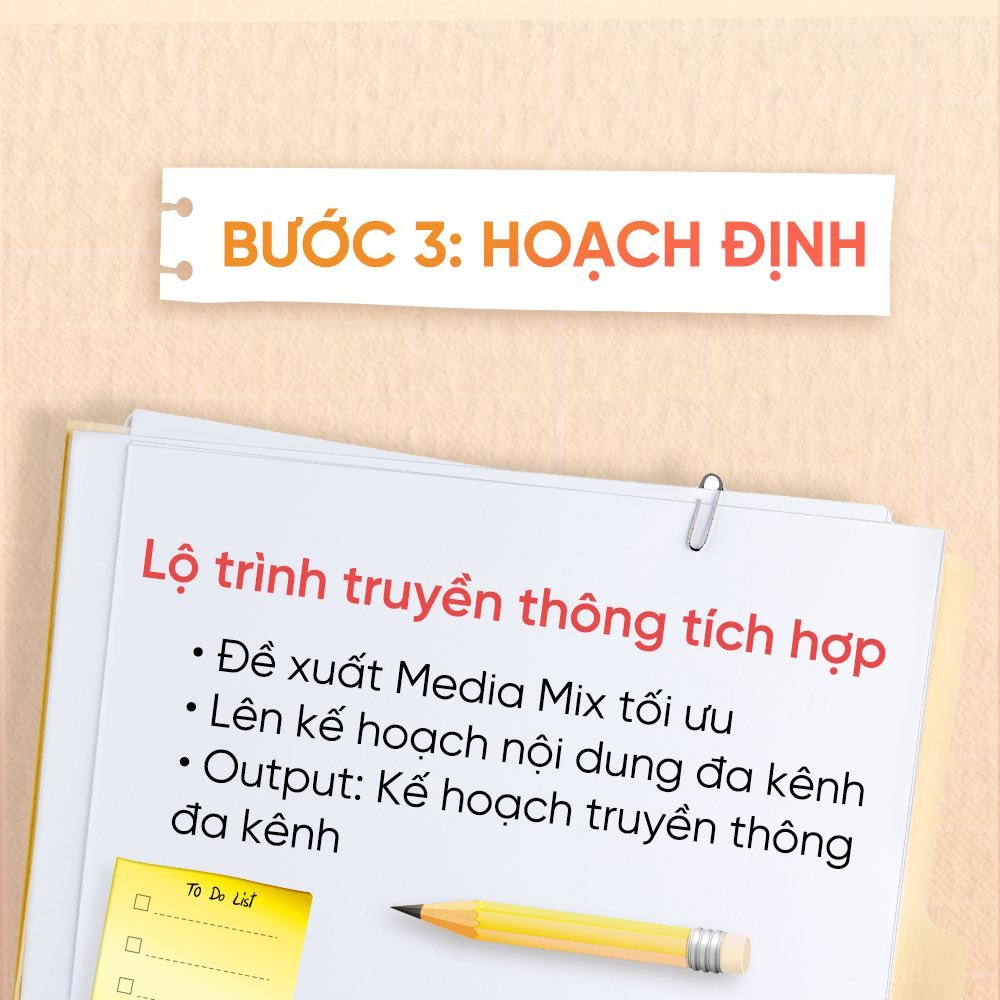
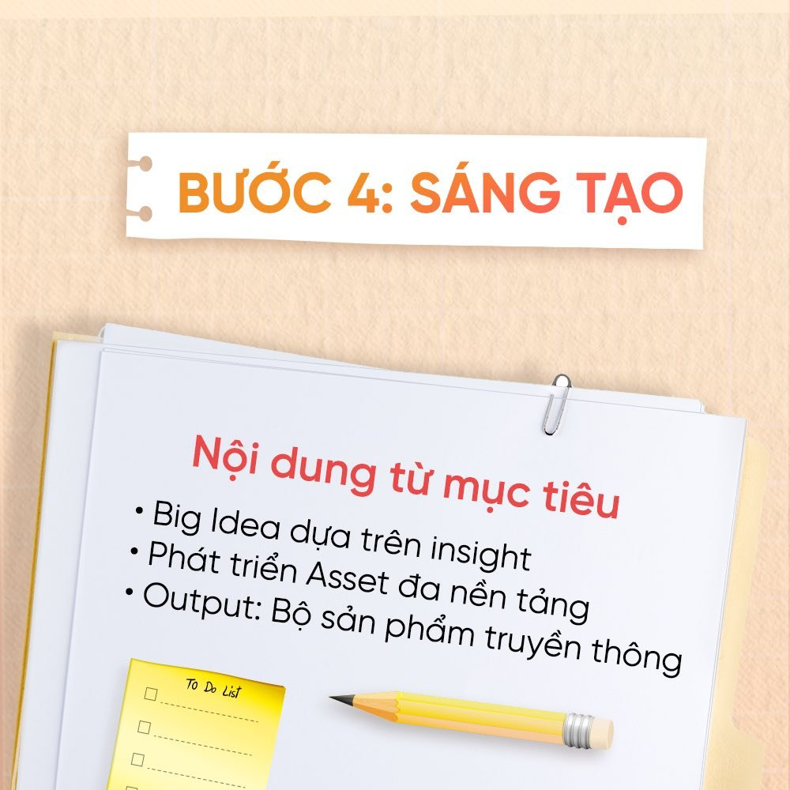
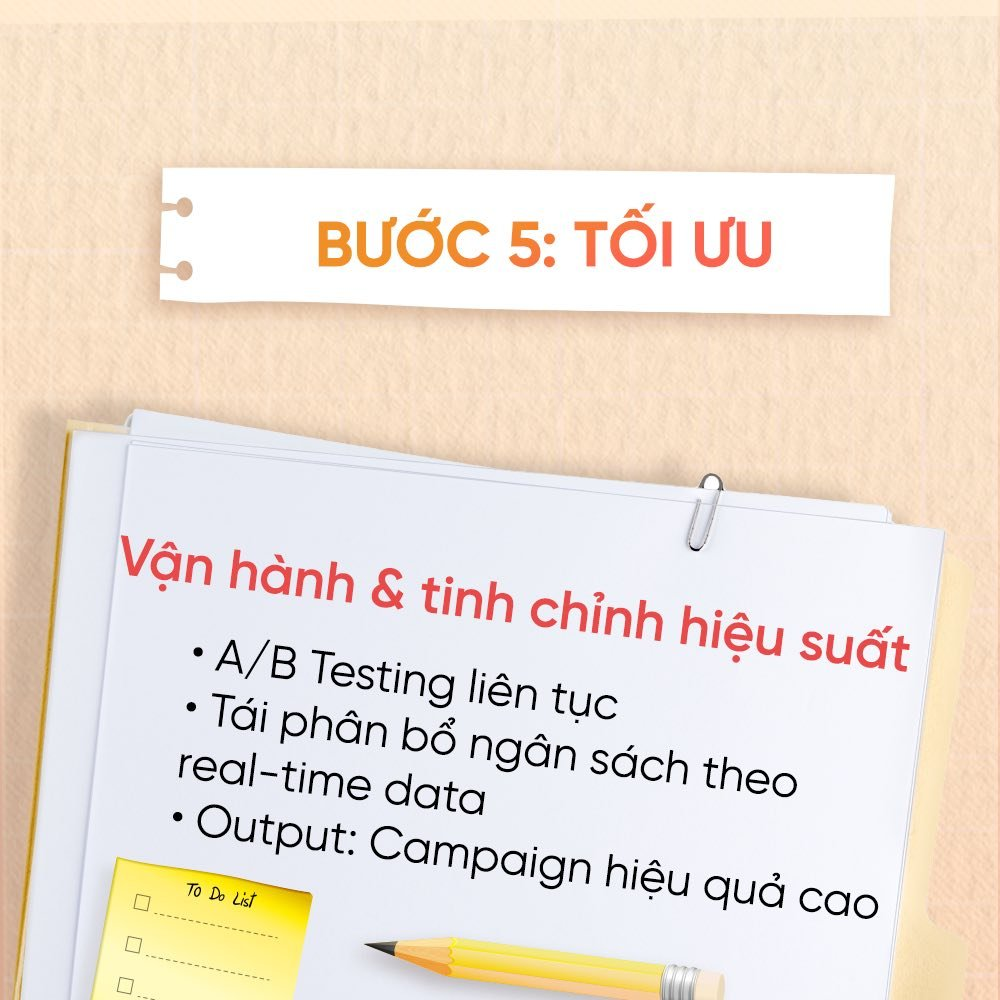
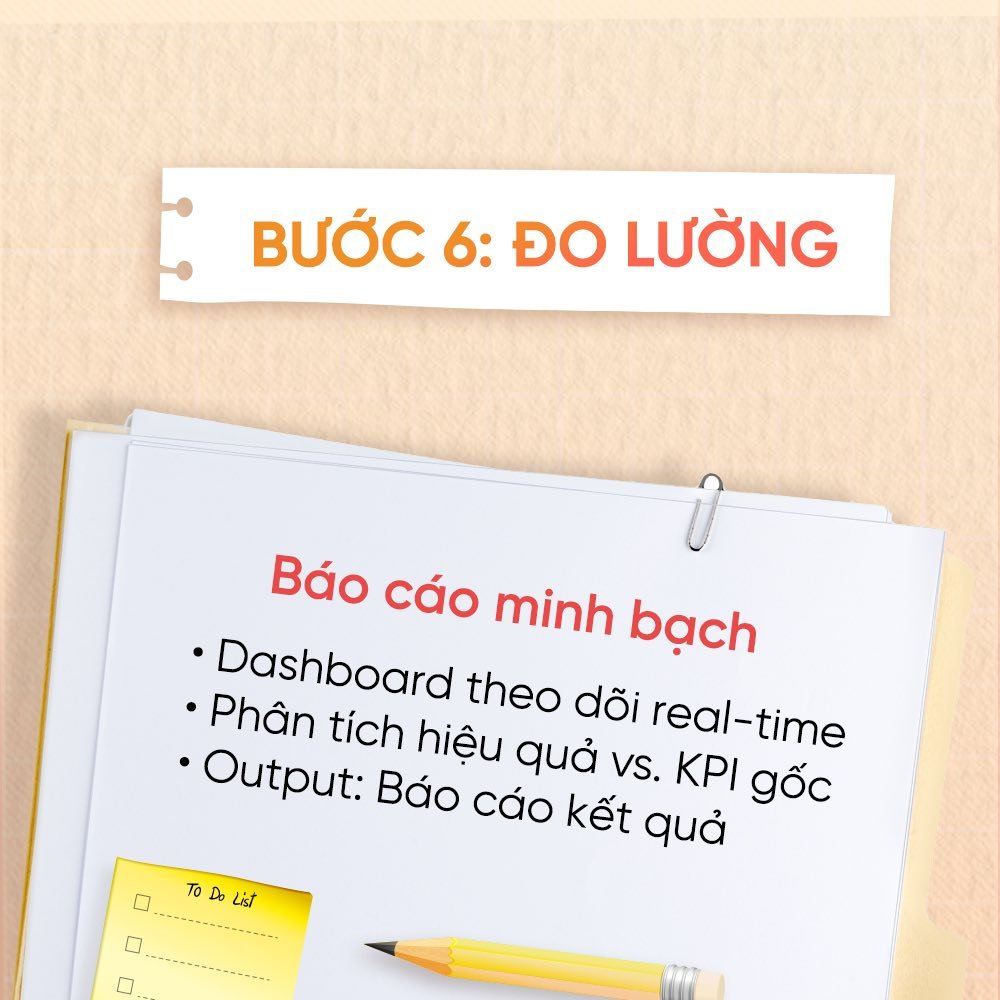
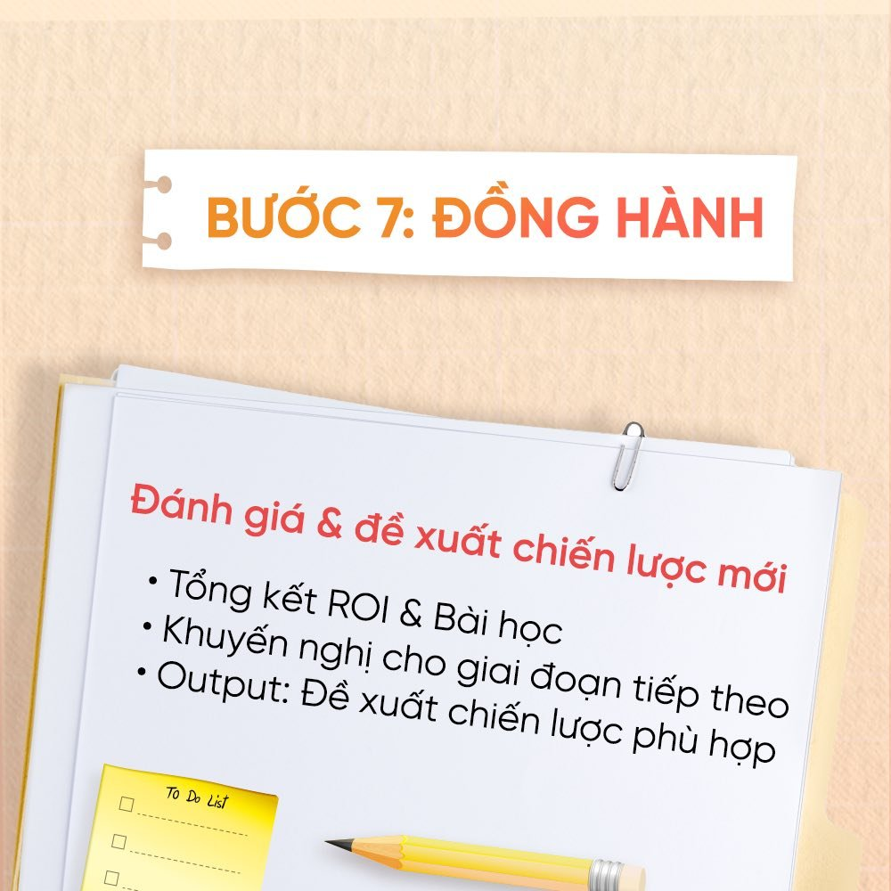

Have you ever wondered how a well-crafted communications campaign is created? In reality, it is not the product of spontaneous ideas but of a tightly built and operated strategic process. At G12 Media, every project begins with a deep understanding of the client's business problem, then develops fitting, optimised communications solutions for maximum impact. The end goal is not just an impressive brand image, but real financial value and effectiveness for the client.

To turn a communications idea into real results, G12 Media works through a clear, strategic process — from market research and customer insight to creative development, content execution and measurement. This process is what turns ideas from plans on paper into campaigns that deliver real value. Here are the steps G12 Media takes to turn an idea into results.

## STEP 1: DIAGNOSE

## STEP 2: ANALYSE

## STEP 3: PLAN

## STEP 4: CREATE

## STEP 5: OPTIMISE

## STEP 6: MEASURE

## STEP 7: PARTNER ON

If you are looking for a way to refresh your brand image and make a decisive breakthrough in the market, G12 Media is ready to walk with you. With strategic thinking and hands-on experience across many real campaigns, we help brands be not only seen but remembered — creating lasting value. Contact G12 Media today for tailored advice, and let's open new growth opportunities for your brand together!
